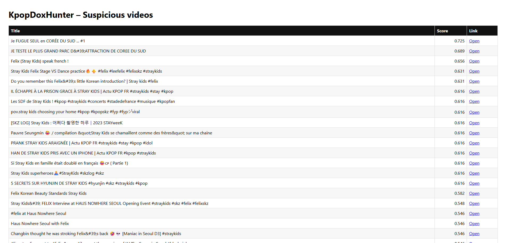

# KpopDoxHunter

KpopDoxHunter is a small anti-doxxing experiment for K-pop idols. It runs a few YouTube searches with suspicious phrases and uses a lightweight ML filter (TF-IDF + cosine similarity) to flag videos that might leak addresses or home details.

The goal is to show:
- How to mix the YouTube Data API with a simple NLP pipeline.
- How to serve a tiny monitoring dashboard with Flask and pandas.

---

## Dashboard Preview



*Live Flask dashboard displaying videos sorted by doxxing risk score*

---

## Features

- Runs predefined YouTube searches (French/English) around Felix (Stray Kids) and doxxing-style phrasing.
- Vectorizes titles + descriptions with TF-IDF and scores them against a small doxxing corpus using cosine similarity.
- Saves results to timestamped CSV files in `reports/` and serves the latest report via a simple Flask dashboard.

Example report files included in the repo:
- `reports/dox_report_20251215_2250.csv`
- `reports/dox_report_20251215_2312.csv`
- `reports/dox_report_20251215_2352.csv`

---

## Tech stack

- Python 3.12
- YouTube Data API v3
- pandas, numpy
- scikit-learn (TF-IDF + cosine similarity)
- Flask (minimal dashboard)

Install dependencies with:

```
pip install -r requirements.txt
```

---

## Project structure

```
KpopDoxHunter/
- scan_kpop_doxhunter.py   # ML scanner: YouTube API + TF-IDF + cosine + CSV output
- dashboard.py             # Flask app that serves the latest report
- templates/
  - index.html             # Simple HTML table for the report
- reports/                 # Generated CSV reports (ignored in .gitignore)
- run_all.bat              # Windows helper: run scan + dashboard
- requirements.txt
- .gitignore
```

---

## Setup & usage

### 1. Clone the repo

```
git clone https://github.com/NagisaSano/KpopDoxHunter.git
cd KpopDoxHunter
```

### 2. (Optional) Create a virtualenv

```
python -m venv .venv
.\\.venv\\Scripts\\activate  # Windows PowerShell
```

### 3. Install dependencies

```
python -m pip install -r requirements.txt
```

### 4. Configure your YouTube API key

The scanner **refuses to run** without a key. Set it via the `YOUTUBE_API_KEY` environment variable (read at runtime):

**Windows (PowerShell):**

```
$env:YOUTUBE_API_KEY = "YOUR_YOUTUBE_API_KEY"
```

If the key is missing or invalid, the script stops early with a clear error.

### 5. Run scan + dashboard

On Windows:

```
.\run_all.bat
```

This will:
- Launch the ML scan (`scan_kpop_doxhunter.py`) and generate a report in `reports/` (only if there are hits above the threshold).
- Start the Flask dashboard at `http://127.0.0.1:5000`, which serves the latest CSV as an HTML table.

### 6. Run tests

```
python -m unittest discover -s tests -p "test*.py" -v
```

---

## Notes & limitations

- This is a **toy project** to explore automated doxxing detection; it is not production-grade.
- The corpus and queries are intentionally tiny and biased toward Felix / Stray Kids for simplicity.
- The Flask server runs with `debug=False` by default; enable debug only in development.
- Network failures and empty results are logged; empty CSVs are no longer written. Quota/403/429 responses now stop the scan explicitly.
